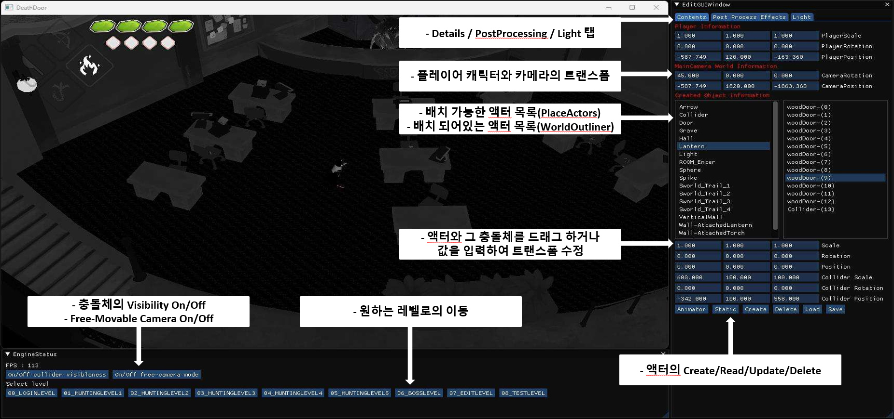
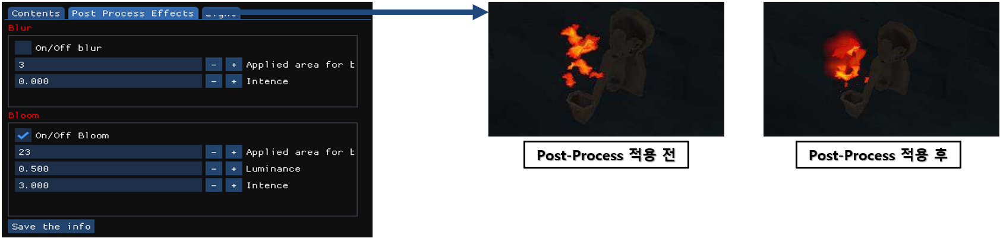
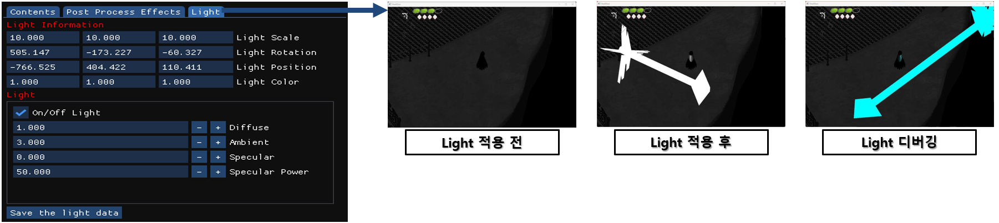
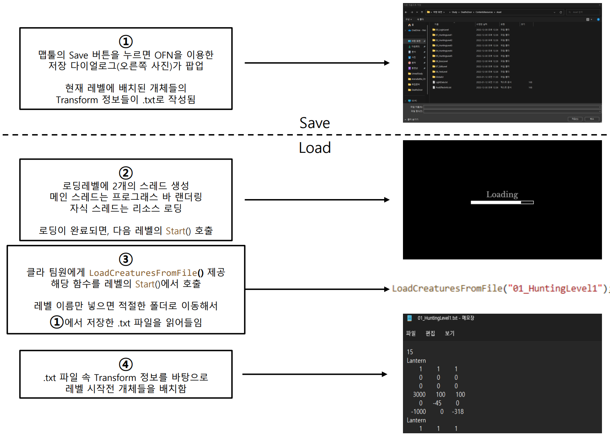
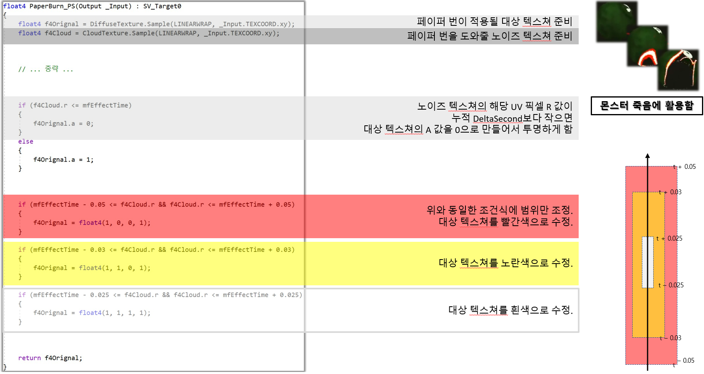
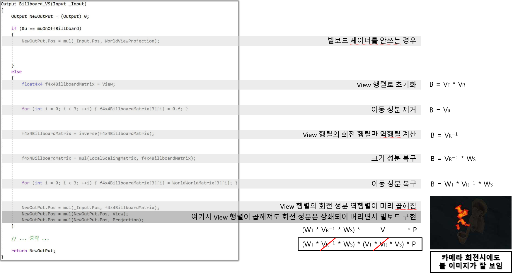
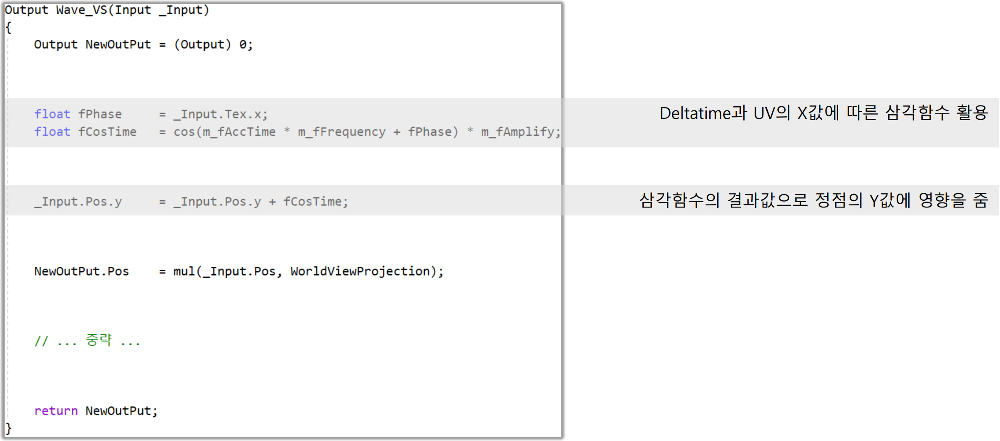

# Dx11_3D_DeathsDoor

   

## 프로젝트 소개
C++, DirectX11, IMGUI를 활용하여 만든 "DeathsDoor" 모작 팀프로젝트입니다.

영상링크: https://www.youtube.com/watch?v=iVvlD-4tXWs

  
멤버 구성은 아래와 같습니다.
 
1. 엔진팀장: 학원 선생님. 기반이 될 엔진 코드를 담당.
   
2. 엔진팀원: 박경호. 엔진 코드 위에서 클라 팀원이 필요로 하는 기능(ex. 에디팅, 리소스 관리, 셰이더, ...) 구현 담당.

3. 클라팀원: 임우정. 컨텐츠(플레이어 캐릭터, 일반 몬스터와 보스몬스터, 기믹, ...) 구현 담당.

개발기간: 2022년 12월 한달간

   

## 엔진 관련 주요 기능
엔진팀원 박경호가 구현한 주요 기능들입니다.

  
언리얼 에디터 모작

   
  
{

   

      <figure>
         
         <figurecaption> 언리얼 에디터에서 지원하는 것들을 최대한 모사하였습니다.</figurecaption>
      </figure>
   
 
   

      <figure>
         
         <figurecaption> 포스트 프로세싱도 에디터에서 쉽게 수정 가능하게끔 구현했습니다.</figurecaption>
      </figure>
   
 
   

      <figure>
         
         <figurecaption> 라이트 관련 설정입니다.</figurecaption>
      </figure>
   
 
   
  
}

  

  

  
스레드를 활용한 리소스 로딩

    
   
{

   

      <figure>
         
         <figurecaption> 멀티스레드를 활용하여 로딩 화면과 리소스 로딩을 구현하였습니다.</figurecaption>
      </figure>
   
 
    
   
}

  

  

  
셰이더 프로그래밍

  
{

  

    
Paper-burn 셰이더

    

      <figure>
         
         <figurecaption> 몬스터 죽음시 Paper-burn 셰이더가 필요하다는 요청을 받고 제작했습니다.</figurecaption>
      </figure>
   
 
     
  

   
  
  

    
Billboard 셰이더

     

      <figure>
         
         <figurecaption> 불이 2D 이미지로 구현된지라, 카메라 회전시 특정 각도에서 보이지 않아서 제작한 Billboard 셰이더입니다.</figurecaption>
      </figure>
   
 
  

   
  
  

    
Wave 셰이더

     

      <figure>
         
         <figurecaption> 불의 2D 이미지가 이글거리게 보이기 위해서, 텍스쳐를 흔드는 Wave 셰이더입니다.</figurecaption>
      </figure>
   
 
  

   
  
}

  

  

   

## 클라 관련 주요 기능
클라팀원 임우정이 구현한 주요 기능들입니다.

### 업로드 예정...

